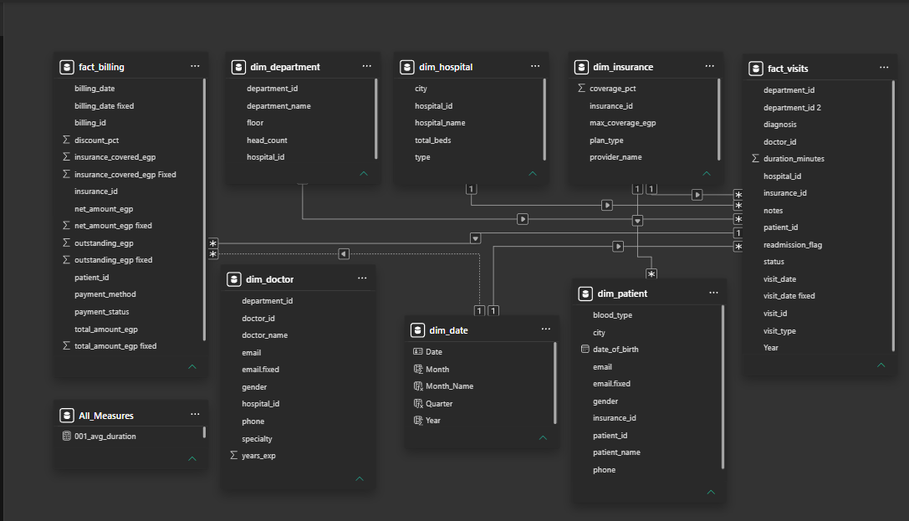
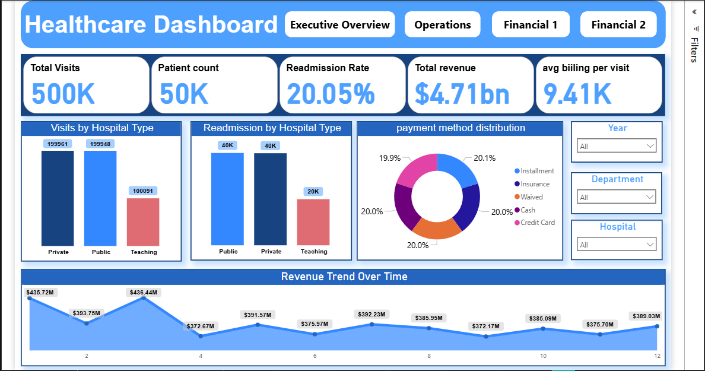
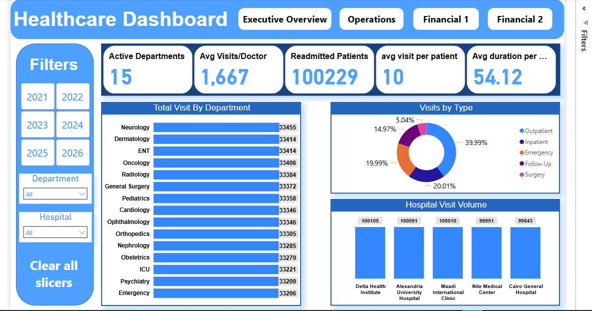
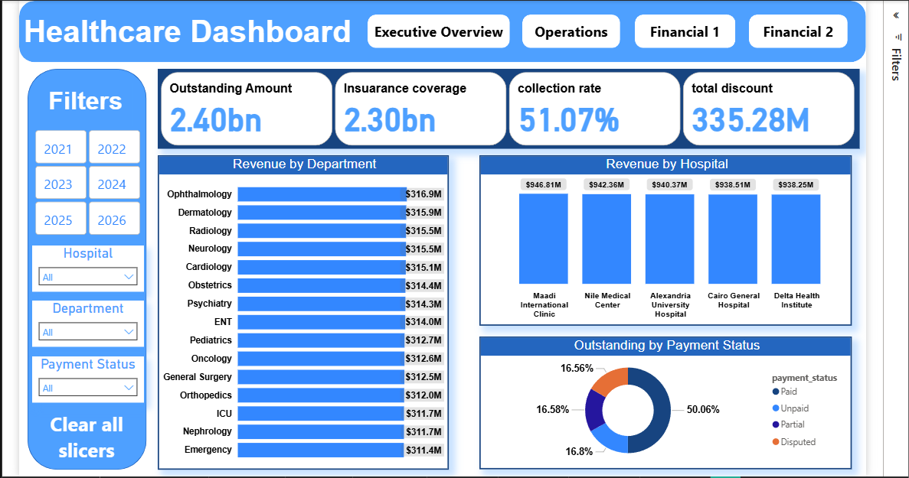
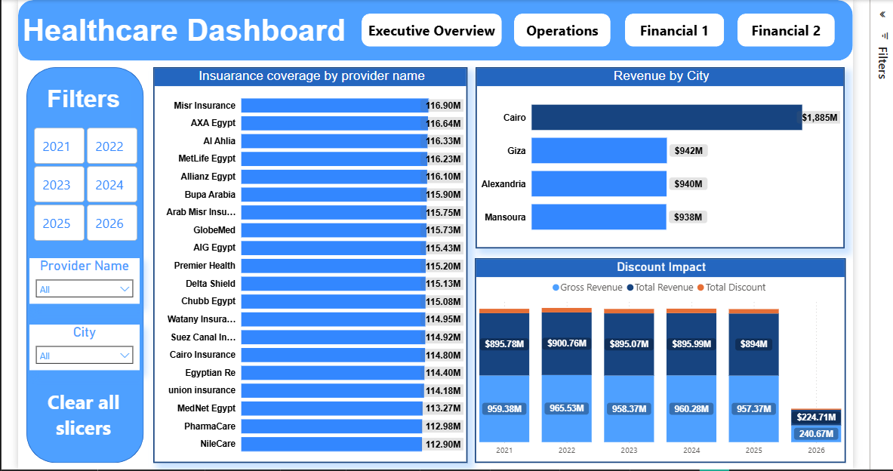

#  Healthcare Analytics Dashboard

##  Project Overview
An interactive Power BI dashboard designed to analyze healthcare operations, patient activity, hospital performance, and financial metrics using a multi-fact star schema data model.

The project combines operational analytics with financial reporting to provide actionable insights into:
- Patient visits
- Hospital performance
- Revenue analysis
- Insurance coverage
- Billing efficiency
- Readmission trends

---

#  Business Objectives
- Monitor hospital operational performance
- Analyze patient visit behavior
- Track readmission rates
- Evaluate financial performance across hospitals and departments
- Analyze insurance coverage and outstanding balances
- Improve revenue visibility and collection efficiency

---

#  Tools & Technologies
- Power BI
- Power Query
- DAX
- Data Modeling
- Data Visualization

---

#  Data Model

The dashboard was built using a multi-fact Star Schema model for optimized analytical reporting and scalability.

## Fact Tables
### fact_visits
Contains operational healthcare visit data including:
- Visit details
- Patient activity
- Doctor assignments
- Visit duration
- Readmission information
- Visit types

### fact_billing
Contains financial and billing data including:
- Billing amounts
- Insurance coverage
- Outstanding balances
- Discounts
- Payment methods
- Payment status

---

## Dimension Tables
- dim_patient
- dim_doctor
- dim_department
- dim_hospital
- dim_insurance
- dim_date

---

## Star Schema Design

---

#  Dataset Information
- 500K+ healthcare visit records
- Financial and operational healthcare data
- Multi-hospital performance tracking
- Insurance and billing analytics
- Multi-year historical analysis

---

#  Data Preparation
Performed extensive data cleaning and transformation using Power Query:
- Removed inconsistencies
- Corrected data types
- Standardized hospital and department data
- Fixed date formatting
- Optimized relationships
- Created calculated columns and measures

---

#  Advanced DAX Measures

## Operational Metrics
- Total Visits
- Patient Count
- Avg Visit Duration
- Avg Visits per Patient
- Avg Visits per Doctor
- Readmission Rate
- Active Departments

## Financial Metrics
- Total Revenue
- Gross Revenue
- Outstanding Amount
- Collection Rate
- Insurance Coverage
- Avg Billing Per Visit
- Total Discount

---

#  Dashboard Pages

## Executive Overview
Provides a high-level overview of:
- Total visits
- Patient count
- Readmission rate
- Revenue trend
- Payment method distribution
- Hospital type comparison

---

## Operations
Focused on:
- Visit volume by department
- Visit type distribution
- Hospital visit volume
- Doctor productivity
- Patient activity
- Readmitted patients

---

## Financial Analytics 1
Focused on:
- Outstanding balances
- Insurance coverage
- Collection rate
- Department revenue
- Revenue by hospital
- Payment status analysis

---

## Financial Analytics 2
Focused on:
- Insurance provider analysis
- Revenue by city
- Discount impact
- Financial trend monitoring
- Coverage comparison

---

#  Key Insights
- Private hospitals generated the highest visit volume.
- Readmission rates represented a significant operational KPI.
- Insurance coverage had a major impact on outstanding balances.
- Revenue performance varied across hospitals and departments.
- Collection rates highlighted payment efficiency opportunities.

---

#  Recommendations
- Improve monitoring of high readmission departments.
- Optimize billing and collection workflows.
- Reduce outstanding balances through payment follow-up processes.
- Enhance operational efficiency in lower-performing hospitals.
- Improve insurance claim processing efficiency.

---

#  Dashboard Preview

## Executive Overview

---

## Operations

---

## Financial Analytics 1

---

## Financial Analytics 2

---

#  Project Files
- Power BI Dashboard (.pbix)
- Dashboard screenshots
- Star schema model
- DAX measures
- Power Query transformations

---

# Author
Ahmed Mohamed  
Pharmacist & Data Analyst | Power BI | SQL | Python | Healthcare Analytics
